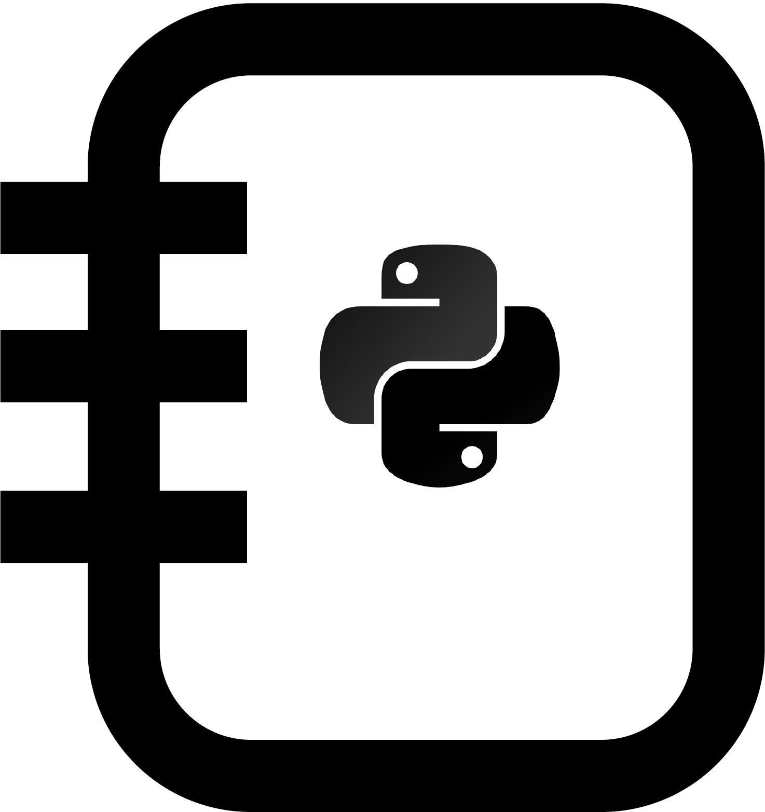

# learn-python 

</img>
[Python](https://python.org) cheat sheet and Playground with standard examples.

[learn-python](https://github.com/moazzam125/learn-python) is basicly, a **Dictionary** with each object defined seperatly with one (or more) standard example(s).

Go to [Wiki](https://github.com/moazzam125/learn-python/wiki) for  detailed & exclusive information, also visit our webpage to get comprehensive information.

## Table of Contents

### [Variables](learn-python/variable)

 1. [String](learn-python/variable/string/string_intro.py)
 2. [Integer](learn-python/variable/integer/integer_intro.py)
 3. [Float](learn-python/variable/float/float_intro.py)
 4. [List](learn-python/variable/list/list_intro.py)
 5. [Tuple](learn-python/variable/list/tuple/tuple_intro.py)
 6. [Dictionary](learn-python/variable/dictionary/dictionary_intro.py)
 7. [Boolean](learn-python/variable/boolean/boolean_operators.py)

### [Operators](learn-python/operator)

 1. [Basic](learn-python/operator/operator.py)
 2. [Arithmetic](learn-python/operator/operator.md#Arithmetic)

### [Input](learn-python/input)

 1. [Terminal input](learn-python/input/input_intro.py)

### [Loops](learn-python/loop)

 1. [For](learn-python/loop/for/for_intro.py)
 2. [While](learn-python/loop/while/while_intro.py)

### [Conditions](learn-python/condition)

 1. [If](learn-python/condition/if/if_intro.py)
 2. [Elif](learn-python/condition/elif/elif_intro.py)
 3. [Else](learn-python/condition/else/else_intro.py)

### [Functions](learn-python/function)

 1. [Function intro](learn-python/function/function_intro.py)
 2. [Parameters & Arguments](learn-python/function/parameter_argument.py)

### [Classes](learn-python/class)

 1. [Class intro](learn-python/class/class_intro.py)
 2. [Inheritance](learn-python/class/inheritance.py)

### [Exceptions](learn-python/exception)

 1. [Handle Exception](learn-python/exception/handle_exception.py)

### [Module](learn-python/module)

 1. [Import module](learn-python/module/module_import.py)

### [Files](learn-python/files)

 1. [Reading File](learn-python/files/file_read.py)
 2. [Writing File](learn-python/files/file_write.py)

### [Standard Library](learn-python/standard_library)

 1. [Module index](learn-python/standard_library/standard_library.md) included all modules

**[Testing your code](learn-python/tests)**

Go to docs for [Python2.7 Syntax differences](docs/syntax_python27.md)

Contributing
------------

You can pull requests and discuss ideas.
Feel free to improve learn-python.

Mailing Sites
-------------

The following mailing list and Discord channel are used for support:

* Dev Discuss : https://discuss.python.org/
* Email     : info@python.org

Discord channel:

* Server     : https://pythondiscord.com/
* Channel    : #help-available

-------------

<a href="https://docs.moazzam.live/learn-python" title="Docs"></img></a>